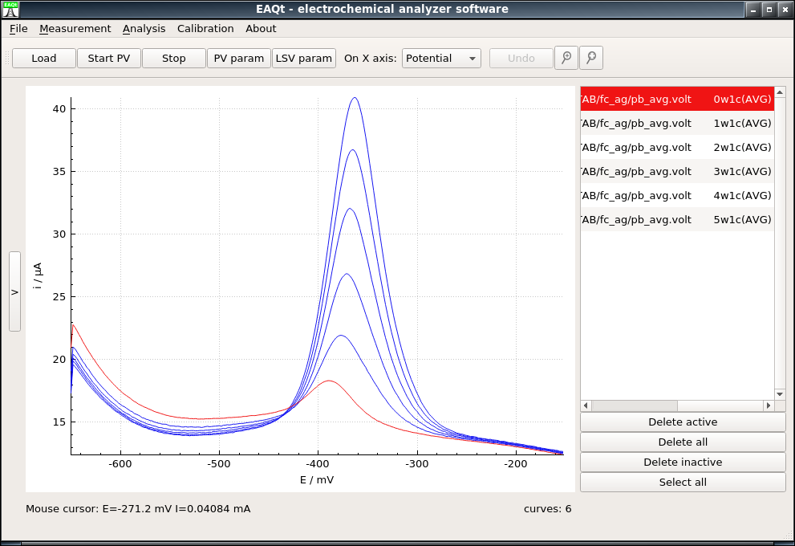
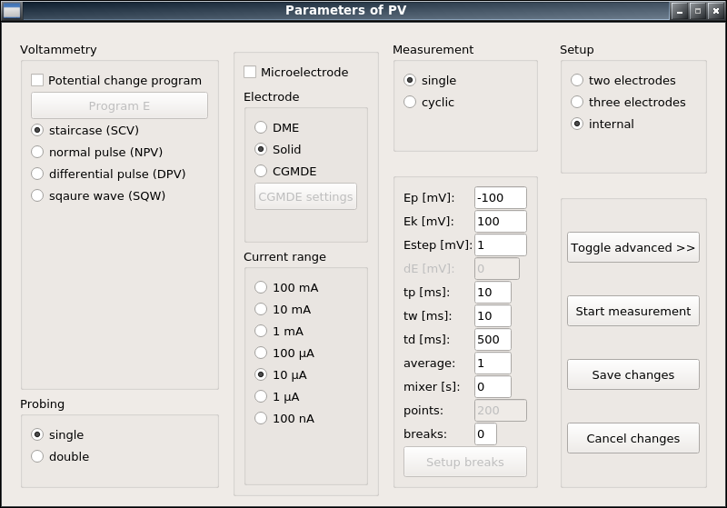
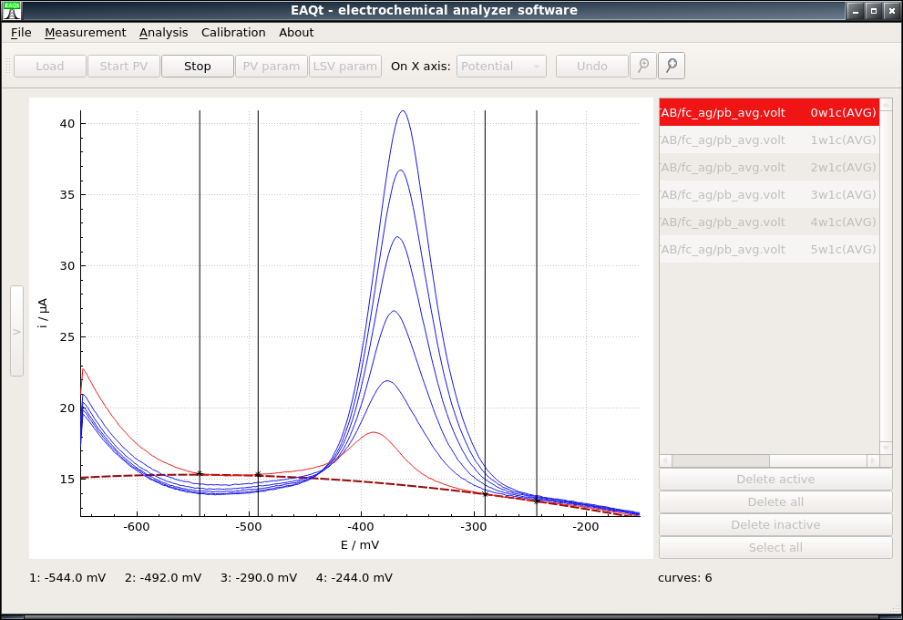
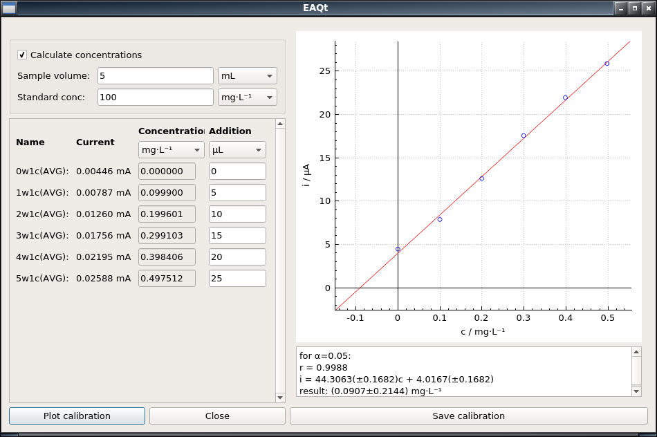

# EAQt Electrochemical Analyzer Software based on Qt API
EAQt is a full suite voltammetric application. Its main goal is to provide simple and modern interface for 
electrochemical analyzer interaction. The build-in functions include configuration of the measurement, data acquisition, data presentation during measurement in real-time, and data processing and analysis procedures. The software can communicate with MTM-ANKO M161, M20, and 8KCA electrochemical analyzers.
Its main window:

provides the possibility to browse simultaneously through multiple experimental signals and change their domain from potential to time or to multisampled (non-averaged) data.
The measurement configuration window:

allow to easily configure any voltammetric measurement (in unlikely situation when the desired potential program is not readily available, one can simply type the potential in order).
After the measurement, the data can be pre-processed (e.g. its background removed with polynomial):

and in the final step calibration (or standard addition) method can be applied to the data:

The application uses its own file extension for handling the measurement result ".volt". The .volt file
format is described in separate file. However, it is able to load .vol file
of EALab and EAGraph. This program makes use of following software:
- Qt API (https://www.qt.io) (LGPLv3 license).
- QCustomPlot (http://www.qcustomplot.com) library for displaying plots (GPLv3 license).
- Eigen library (http://eigen.tuxfamily.org) for matrix operations and signals processing (MPL 2.0 license).
- kissFFT (https://sourceforge.net/projects/kissfft/) for FFT and iFFT (revised BSD license).
- pstdin.h (http://mrpt.sourceforge.net/reference/0.6.5/pstdint_8h-source.html) for compatibility on Windows (revised BSD license).
- LiberationSans font (https://pagure.io/liberation-fonts/) (SIL OPEN FONT license).

# Development and compilation
This program is developed with QtCreator for Qt >= 5.8. Every dependency is included
in the repository, and it should be compatible with Windows, Linux and MacOS. 

# Installation
As for the moment no official binary form is available, as the software is under heavy development
and possibly contains bugs, which may result in the loss of data.

# License
EAQt is licensed under GPLv3. Licenses are available in About->Licenses, or with the source code.

# Author
This program is mainly developed by Filip Ciepiela <filip.ciepiela@agh.edu.pl> and Małgorzata Jakubowska <jakubows@agh.edu.pl>, however every commit is welcome.
